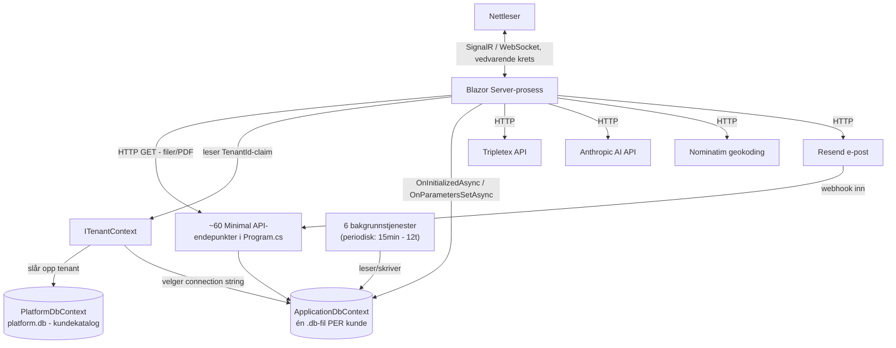

# Kodegjennomgang — portal.itlock

Dato: 2026-10-08
Omfang: Hele `src/PortalItlock.Web` — alle 144 sider, alle 73 services, kjerneinfrastruktur (Program.cs, DbContext, bakgrunnstjenester, delte layout-/navigasjonskomponenter). Fokus: ytelse (høyeste prioritet), bugs, struktur, kommunikasjon mellom lag.

**Status: Fase 4 (fiksing) pågår.** Du godkjente "fiks alt" med fire presiseringer (se del D): WAL-modus ja (etter backup-sjekk), kun redusere rundturer (ikke IDbContextFactory), søkefiksen ja (ble underveis en større/riktigere løsning enn først antatt pga. en reell æøå-regresjon oppdaget via test — avklart med deg underveis), filoppdeling nei nå. Se **"Status per modul/funn"**-kolonnen i tabellene under for hva som er gjort.

## Fikset så langt (9 commits, alle bygget + testet + pushet til main)

| # | Fiks | Commit |
|---|---|---|
| A1 | Varseltall caches 20s i stedet for å spørres på hver navigasjon | `3977ccb` |
| A3 | WAL-modus på SQLite + checkpoint før backup | `1ae888d` |
| Bug | DorDetalj N+1 (lagrede PDF-er) | `33c9228` |
| Bug | NyPakke N+1 (dørfunksjoner ved lagring) | `33c9228` |
| Bug | TicketDetalj kartesisk Include → AsSplitQuery | `33c9228` |
| Bug | koblingsskjema.js lekkende keydown-lytter | `33c9228` |
| Høy | SokResultat: søk filtreres i SQL (egen Unicode-korrekt funksjon, ikke EF.Functions.Like — se forklaring over) | `9774286` |
| Høy | SalgPerKunde/Fakturaoversikt: Tripletex-kall caches 5 min | `9713bbf` |
| Høy | Serviceavtaler + Home (Dashboard3-kart): geokoding kjører i bakgrunnen, blokkerer ikke lenger sidevisning | `6acdec8` |

Alle 49 tester passerer (42 eksisterende + 7 nye regresjonstester skrevet for disse fiksene). Alle er bygget, og testet enten live i nettleser eller — der dev-databasen var tom og hindret reell rundtur-testing (DorDetalj/TicketDetalj/KoblingsSkjemaVisning sine detaljsider, og den progressive kart-pin-oppdateringen) — dekket av nye enhetstester og nøye kodegjennomgang i stedet. Dette er notert eksplisitt i de respektive commit-meldingene.

**Gjenstår** (ikke påbegynt ennå): de resterende "Høy"-radene i modul-tabellen i del B (ArbeidsordreSkjema, ProsjektSkjema, KundeSkjema, TilbudSkjema, Home.razor standard-variant, Komponenter.razor, Timeregistrering, ForesporselListe, Dashbord.razor), samt de "Middels"-vurderte funnene i del C. Dette er write-ups av hva som gjenstår og hvorfor — selve fiksingen fortsetter i påfølgende arbeidsøkter.

Denne gjennomgangen er adskilt fra `SECURITY_AUDIT.md` (sikkerhet er allerede dekket og fikset i en tidligere, separat jobb) — denne rapporten dupliserer ikke det arbeidet.

---

## Fase 1 — Kartlegging

### Stack og arkitektur
- **Blazor Server** (.NET 8), ikke WASM/SPA — `app.MapRazorComponents<App>().AddInteractiveServerRenderMode()` i `Program.cs:446-447`. Hele appen kjører som server-rendret UI over én vedvarende SignalR-krets per nettleserfane. Dette er en viktig presisering: konseptet "kode-splitting per rute"/"bundle-størrelse" fra den generelle ytelses-sjekklisten **gjelder ikke** denne arkitekturen — det finnes ingen JS-bundles å splitte. "Tregt å klikke" i Blazor Server skyldes nesten alltid: (a) tung/sekvensiell serverarbeid i `OnInitializedAsync`/`OnParametersSetAsync` før noe rendres, og (b) ingen visuell tilbakemelding mens det arbeidet pågår.
- **Database**: EF Core 8 + SQLite. Én fysisk `.db`-fil per kunde (tenant) + én liten delt `PlatformDbContext`-fil (kundekatalogen). Tilkoblingsstreng velges server-side per request via `ITenantContext` (leser en claim fra innloggingscookien).
- **Flerkunde**: i dag kun 1 reell kunde (itlock AS selv), men arkitekturen og brukerens uttalte planer om videresalg til andre firma er relevant for flere funn under.
- **Eksterne tjenester**: Tripletex (regnskap, 20s timeout), Anthropic (AI-assistent, 60s timeout), Resend (e-post inn/ut), Nominatim/OpenStreetMap (geokoding, 5s timeout), Brønnøysundregistrene, GitHub (databasebackup).
- **Bakgrunnstjenester** (6 stk, `IHostedService`): `PrisendringBackgroundService`, `ServiceVarselBackgroundService`, `LisensVarselBackgroundService`, `TicketEskaleringBackgroundService`, `DatabaseBackupBackgroundService`, `TripletexSyncBackgroundService`.
- **Filer**: alle opplastede filer (bilder, PDF, vedlegg) lagres som `byte[]` BLOB i databasen, serveres via egne `/komponent/{id}/bilde`-type GET-endepunkter i `Program.cs` (~30 stk, nesten identisk mønster).
- **Tester**: kun 3 små enhetstester (`PasswordHasherTests`, `FilSikkerhetTests`, `ForsideRendererTests`, totalt 164 linjer). Ingen integrasjonstester av sider, spørringer eller bakgrunnstjenester.

### Dataflyt (forenklet)

### Modulinventar og metodikk
Alle 144 sider i `Components/Pages/` er gjennomgått, gruppert etter domene (6 grupper + 1 infrastruktur-gjennomgang), hver med egen fokusert sjekk av: antall/rekkefølge på databasekall i `OnInitializedAsync`/`OnParametersSetAsync`, visuell respons ved klikk, åpenbare bugs, og filstørrelse/struktur. Se modul-tabellen i del B for alle 144 sider.

### Hvordan verifisere at alt fungerer som før (etter Fase 4-fikser)
- Kjør eksisterende tester: `dotnet test` (3 tester i dag, flere legges til for det som fikses).
- For hver endret side: åpne siden i nettleser før og etter, sammenlign at nøyaktig samme data/felter vises (manuell smoke-test, slik det også ble gjort for fargetema-funksjonen tidligere i dag).
- For ytelsesfikser: mål faktisk responstid i nettleserens devtools (Network-fane, tid til første byte / tid til DOM ferdig) før og etter, ikke bare stol på estimatene i denne rapporten.

---

## Fase 2/3 — Funn

## A. Funn som påvirker MANGE eller ALLE moduler samtidig

Les disse først — de forklarer trolig mesteparten av "tregt å klikke"-opplevelsen, uavhengig av hvilken enkeltmodul man er i.

### A1. 🔴 KRITISK — Varselklokka kjører ~13 sekvensielle databasespørringer på HVER navigasjon, i hele appen
**Fil:linje**: `Components/Layout/NavMenu.razor:350,381-407` + `Services/VarselTellerService.cs:29-89`

**Problem**: `NavMenu` (del av `MainLayout`, brukt av 121 av 144 sider) abonnerer på `NavigationManager.LocationChanged` og kaller `VarselTellerSvc.HentAsync(...)` ved **hver eneste klientside-navigasjon** — altså hver gang noen klikker seg til en ny side hvor som helst i appen. For Admin/Prosjektleder gjør denne metoden **12-13 separate, sekvensielle** `CountAsync`/`ToListAsync`-spørringer (avvik, prosjekter, servicerunder, kunder, komponenter, tickets, tilvalg, driftsmeldinger, CE-godkjenninger, arbeidsordre, kundelisenser, forespørsler, kunngjøringer) — ingen av dem cachet eller parallellisert.

**Konsekvens**: Dette skjer *i tillegg til*, og samtidig med, at selve målsiden kjører sine egne spørringer. Siden det rammer **all navigasjon i hele appen**, ikke bare enkeltsider, er dette trolig den enkeltstørste årsaken til at portalen oppleves treg å klikke seg rundt i — konsekvent, ikke bare i enkelte moduler.

**Forslag**: Cache varseltallene kortvarig (15-30 sekunder) per tenant, f.eks. med `IMemoryCache`. Varseltall trenger ikke sekund-fersk presisjon — en liten forsinkelse på et badge-tall er ikke merkbart for brukeren, men sparer 13 databaserundturer på nesten hvert klikk.

**Størrelse**: Liten-middels (én service + enkel cache-registrering).
**Risiko**: **Lav** — endrer kun HVOR OFTE tallet beregnes på nytt, ikke hva som vises eller logikken bak det. Bør ha en enkel regresjonstest som bekrefter tallene er identiske, bare mindre hyppig beregnet.

### A2. 🟠 HØY — Ingen side viser noen ladetilstand før alt er ferdig lastet
**Fil:linje**: Gjelder alle 144 sider (0 bruker `[StreamRendering(true)]` eller viser skjelett/spinner før `OnInitializedAsync`/`OnParametersSetAsync` er helt ferdig).

**Problem**: Brukeropplevelsen ved klikk er konsekvent: knapp/lenke trykkes → **ingenting synlig skjer** → (etter alle sekvensielle spørringer er ferdig) → hele siden dukker opp på én gang. To unntak med god praksis ble funnet og bør brukes som mal: `MinDag.razor` og `AiAssistent.razor` setter et "laster/venter"-flagg FØR `await`, slik at brukeren ser en umiddelbar tilstandsendring.

**Konsekvens**: Dette er sannsynligvis **hovedårsaken** til den konkrete klagen "det tar lang tid fra man trykker til noe skjer" — ikke nødvendigvis fordi hver spørring i seg selv er treg, men fordi det ikke finnes NOEN tilbakemelding mens serveren jobber.

**Forslag**: Innfør et konsistent mønster på tvers av alle sider: vis layout/overskrift + en enkel "Laster…"-tilstand umiddelbart (sett et `_laster = true`-flagg før `await`, slik `MinDag.razor` allerede gjør), i stedet for å vente med all rendering til alt er hentet.

**Størrelse**: Middels-stor hvis gjort konsekvent for alle 144 sider, men mønsteret i seg selv er lite per side.
**Risiko**: **Lav-middels per side** — endrer ikke hva som vises, bare når/hvordan. Må verifiseres at ingen side er avhengig av at `OnInitialized` er helt ferdig før en omdirigering skjer (noen sider redirigerer basert på lastet data).

### A3. 🟠 HØY — Ingen WAL-journalmodus på SQLite → bakgrunnstjenesters skriving kan blokkere brukeres lesing
**Fil:linje**: `appsettings.json:9` (`"Data Source=portalitlock.db"`, ingen `Cache=Shared`/journalmodus satt) + `Services/TenantProvisioningService.cs:86` (kun `PRAGMA synchronous=NORMAL` ved ny kunde — ikke `journal_mode`).

**Problem**: SQLite sin standard journalmodus (rollback-journal, ikke WAL) betyr at én skrive-transaksjon blokkerer alle samtidige LESERE på samme fil til skrivingen er ferdig. 5 av 6 bakgrunnstjenester skriver periodisk til nøyaktig samme fil som alle innloggede brukeres sidelastinger leser fra — mest fremtredende `TripletexSyncBackgroundService` (hvert 15. minutt, flere `SaveChangesAsync()`-kall + utgående HTTP-kall mellom dem som forlenger hvor lenge tilkoblingen er i bruk).

**Konsekvens**: Når en bruker klikker akkurat idet en bakgrunnstjeneste skriver, må lesingen vente. Dette forklarer trolig hvorfor treghet oppleves **sporadisk** ("noen ganger er det helt greit, andre ganger henger det") snarere enn konstant.

**Forslag**: Sett `journal_mode=WAL` på alle SQLite-tilkoblinger (ny og eksisterende tenant-filer). WAL lar lesere fortsette uforstyrret mens én skriver pågår.

**⚠️ Dette er en databasekonfigurasjonsendring og krever din eksplisitte bekreftelse før den gjøres** (endrer databasefilens format på disk — WAL-modus lager ekstra `-wal`/`-shm`-sidefiler ved siden av `.db`-filen). Spesielt viktig å avklare: **`DatabaseBackupService` sin backup-rutine må verifiseres til å håndtere disse ekstra filene korrekt**, ellers kan en backup bli ufullstendig. Jeg anbefaler denne endringen, men gjør den ikke uten at du sier ja.

**Størrelse**: Liten kodeendring, men bør testes grundig (spesielt backup).
**Risiko**: **Middels** — selve PRAGMA-endringen er lav risiko og reversibel, men backup-kompatibilitet må verifiseres først.

### A4. ⚠️ Viktig teknisk presisering — "kjør parallelt med Task.WhenAll" er IKKE alltid trygt her
Flere funn under (og i alle 6 gruppenes underlagsrapporter) foreslår å parallellisere uavhengige databasekall med `Task.WhenAll`. **Dette krever en presisering**: `ApplicationDbContext` er registrert `Scoped` og injisert direkte i hver side (`@inject ApplicationDbContext Db`) — i Blazor Server er "Scoped" bundet til hele brukerens SignalR-krets, ikke til ett enkelt sideoppslag. EF Core sin `DbContext` er **ikke trådsikker**: å kjøre flere `await`-kall samtidig mot SAMME `Db`-instans kaster `InvalidOperationException`.

Det betyr at ekte parallellisering av databasekall krever enten:
- **(a) `IDbContextFactory<ApplicationDbContext>`** — opprette korte, separate DbContext-instanser per parallelt kall. Dette er en reell arkitekturendring som berører mønsteret i hele appen (alle 144 sider bruker samme injiserte `Db`) — **bør avklares med deg som egen beslutning før den gjøres noe sted**, siden det er mer enn en lokal fiks.
- **(b) Redusere ANTALL rundturer** i stedet for å parallellisere dem — slå sammen spørringer, utsette faner/data som ikke vises først, fjerne unødvendige `Include()`-nivåer. Dette er lav-risiko og krever ingen ny arkitektur.

**Anbefaling**: Bruk (b) som standardløsning i Fase 4 for de fleste "sekvensielle spørringer"-funnene under, og behandle (a) som en egen, separat sak du må si ja til eksplisitt — ikke noe som gjøres stilltiende som en del av enkeltside-fikser.

### A5. 🟠 HØY (ved fremtidig flerkunde-bruk) — 5 av 6 bakgrunnstjenester vil stille ignorere fremtidige nye kunder
**Fil:linje**: `Services/ITenantContext.cs:82,99` + `PrisendringBackgroundService.cs`, `ServiceVarselBackgroundService.cs`, `LisensVarselBackgroundService.cs`, `TicketEskaleringBackgroundService.cs`, `TripletexSyncBackgroundService.cs`

**Problem**: Disse 5 bakgrunnstjenestene kjører utenfor en ekte HTTP-forespørsel, så `ITenantContext` har ingenting å lese vertsnavn/cookie fra og faller alltid tilbake til KUN standard-tenanten (itlock AS selv). Kun `DatabaseBackupService` og Program.cs sin egen oppstarts-seed-løkke looper riktig over alle aktive tenants.

**Konsekvens**: I dag (1 kunde) er dette usynlig og uten konsekvens. Men siden du har planer om å videreselge portalen til andre firma, vil disse 5 tjenestene — prisendringer, servicevarsler, lisensvarsler, ticket-eskalering, Tripletex-synk — **aldri kjøre for noen kunde nr. 2, 3 osv.**, stille og uten feilmelding.

**Forslag**: Gjør de 5 tjenestene tenant-bevisste — loop over alle aktive tenants og opprett `ApplicationDbContext` manuelt per tenant, samme mønster som Program.cs sin seed-løkke allerede bruker (`Program.cs:303-335`).

**Størrelse**: Middels (5 filer, samme mønster gjentas — kan trekkes ut til en delt hjelpemetode).
**Risiko**: **Lav-middels** — endrer ikke dagens oppførsel for den ene eksisterende tenanten, utvider bare dekningen. **Ikke en hastesak nå, men bør gjøres før kunde nr. 2 onboardes** — bør flagges som eget oppfølgingspunkt, ikke nødvendigvis del av denne ytelsesrunden.

### A6. 🟡 MIDDELS — Manglende `AsNoTracking()` på rene lesespørringer, gjennomgående
**Fil:linje**: Bekreftet fravær i samtlige 144 sider (0 treff totalt).

**Problem**: Ingen side bruker `.AsNoTracking()` på spørringer som kun viser data. EF Core sin change-tracking (snapshot-sammenligning for hver hentet rad) er ren overhead for visning-uten-redigering, og blir merkbart med mange rader/dype `Include`-kjeder.

**Forslag**: Legg til `.AsNoTracking()` på spørringer som kun populerer en liste/tabell for visning — side for side, siden noen sider redigerer de samme hentede objektene direkte senere (må sjekkes individuelt der).

**Størrelse**: Liten per side, mange steder — gjøres som en serie små, uavhengige endringer.
**Risiko**: **Lav** for rene listevisninger. **Middels-høy** for sider som også lagrer endringer på samme hentede objekt i samme scope — må sjekkes nøye der, feil bruk kan gjøre at `SaveChangesAsync()` slutter å lagre endringer.

---

## B. Modul-tabell — alle 144 sider, tregeste først (ESTIMAT basert på kode, ikke målt i produksjon)

| # | Side | Est. alvorlighet | Hovedårsak | Forslag |
|---|---|---|---|---|
| 1 | **Dashbord.razor** | 🔴 Kritisk | `OnInitializedAsync` henter HELE Tilbud-, Prosjekt- (5-nivå Include), Arbeidsordre- (5-nivå Include), Ticket- og Driftsmelding-tabellene uten dato-/statusfilter. Vokser lineært med hele firmaets historikk. | Filtrer på tidsrom/status før henting, fjern unødvendige Include-nivåer, vurder SQL-aggregering i stedet for i-minne-summering. |
| 2 | **ArbeidsordreSkjema.razor** | 🟠 Høy | 16 sekvensielle DB-kall i `OnParametersSetAsync` før noe vises. | Reduser antall rundturer; utsett faner/data (sjekklister, PDF-historikk, bilder) til de faktisk åpnes. |
| 3 | **ProsjektSkjema.razor** | 🟠 Høy | 11 sekvensielle DB-kall — appens mest brukte redigeringsside. | Slå sammen spørringer der mulig; `AsNoTracking()` på lookup-lister. |
| 4 | **KundeSkjema.razor** | 🟠 Høy | 11 sekvensielle DB-kall. | Utsett faner (tilbud/arbeidsordre) til de åpnes. |
| 5 | **Home.razor "/"** (standardlayout) | 🟠 Høy | 15-20+ sekvensielle DB-kall i `OnInitializedAsync` — appens mest besøkte side. | Reduser antall rundturer/slå sammen spørringer. |
| 6 | **Home.razor "/"** (Dashboard3-layout) | 🟠 Høy | Sekvensiell ekstern geokoding (opptil N×5s) for prosjekter uten lagrede koordinater. | Flytt til bakgrunn/cache, eller kjør med kortere total-timeout. |
| 7 | **SokResultat.razor** | 🟠 Høy | Henter 4 HELE tabeller (Kunder/Prosjekter/Tickets/Forespørsler) til minnet ved hvert søk, pga. case-insensitiv `.Contains` som ikke kan oversettes til SQL. | Bruk `EF.Functions.Like` for SQL-filtrering. **Spør bruker først** — marginal endring i søkeoppførsel på spesialtegn mulig. |
| 8 | **DorDetalj.razor** | 🟠 Høy | ~10 sekvensielle spørringer + bekreftet N+1-bug (ett DB-kall per avvik, linje 650-654). | Reduser rundturer; bytt N+1-løkke til samlet oppslag. |
| 9 | **ForesporselListe.razor** | 🟠 Høy | `.Include(f => f.Media)` henter full vedleggs-byte-data for HELE listen ved hver innlasting/handling. | Projiser bort `Data`-feltet i listevisning, hent kun ved faktisk åpning av vedlegg. |
| 10 | **TilbudSkjema.razor** | 🟠 Høy | 7+ sekvensielle DB-kall. | Reduser rundturer. |
| 11 | **Serviceavtaler.razor** | 🟠 Høy | Sekvensiell, blokkerende ekstern geokoding for HVER avtale uten lagrede koordinater ved sideåpning. | Flytt til bakgrunn, ikke-blokkerende rendering. |
| 12 | **SalgPerKunde.razor** | 🟠 Høy | Live, ucachet kall mot Tripletex ved hver åpning (opptil 20s timeout, ingen fallback). | Cache kort (5-15 min), vis cachet data umiddelbart. |
| 13 | **Fakturaoversikt.razor** | 🟠 Høy | Samme som over (deler Tripletex-kall). | Samme løsning. |
| 14 | **Komponenter.razor** | 🟠 Høy | 5 sekvensielle spørringer + laster hele ~25 000-rads komponentkatalogen i minnet på hver åpning (viser kun 50). | Parallelliser/reduser rundturer; vurder ekte server-side paginering (større jobb). |
| 15 | **Timeregistrering.razor** | 🟠 Høy | Henter ALLE arbeidsordre (kun til nedtrekksliste) + ubegrenset egen timehistorikk. | Filtrer nedtrekk til aktive; paginer historikk (f.eks. siste 12 uker). |
| 16 | **Lasplan.razor** | 🟡 Middels-Høy | 8-10 sekvensielle spørringer. | Reduser rundturer. |
| 17 | **TicketDetalj.razor** | 🟡 Middels-Høy | Kartesisk produkt i Include-spørring (to samlinger i samme query uten `AsSplitQuery()`). | Legg til `.AsSplitQuery()` — én linje. |
| 18 | **KoblingsSkjemaVisning.razor** | 🟡 Middels | 4 spørringer + tung JS-initialisering (zoom/pan/symboler) ved render. | Lavere prioritet; vurder utsatt init for store skjema. |
| 19 | **RapportProdukt.razor** | 🟡 Middels | Henter ALLE arbeidsordre i perioden m/dype Include, aggregerer i minnet. | Flytt summering til SQL der mulig. |
| 20 | **RapportResultat.razor** | 🟡 Middels | Identisk mønster som RapportProdukt. | Samme. |
| 21 | **RapportKunde.razor** | 🟡 Middels | Identisk mønster. | Samme. |
| 22 | **Driftsmeldinger.razor** | 🟡 Middels | Henter ALLE driftsmeldinger/tickets/dører noensinne, ingen paginering. | Paginer, filtrer standard til "siste 12 mnd". |
| 23 | **CeGodkjenningerListe.razor** | 🟡 Middels | Henter ALLE CE-godkjenninger + ekstra full spørring for tilknyttede komponenter. | Paginer/filtrer som standard. |
| 24 | **Plattform.razor** (+ `TenantStatistikkService`) | 🟡 Middels (blir Høy ved flere kunder) | Synkron, blokkerende SQLite-telling PER TENANT på admin-dashbordet. | Gjør async, cache noen minutter. |
| 25 | **Prosjekter.razor** (prosjektliste) | 🟡 Middels | 5 sekvensielle spørringer, 3 uavhengige. | Reduser rundturer. |
| 26 | **KontrollTarn.razor** | 🟡 Middels | 9 sekvensielle COUNT-spørringer. | Reduser rundturer/slå sammen til færre spørringer. |
| 27 | **Kalender.razor** | 🟡 Middels | 4 sekvensielle spørringer + ubegrenset prosjekt-nedtrekksliste. | Reduser rundturer; filtrer nedtrekk til aktive prosjekter. |
| 28 | **OppdaterPriser.razor** | 🟢 Lav-Middels | 2 uavhengige sekvensielle spørringer. | Reduser rundturer. |
| 29 | **NyPakke.razor** | 🟢 Lav-Middels | Bekreftet N+1-bug ved lagring (én spørring per valgt dørfunksjon). | Samlet `Where(...Contains(...))`-oppslag i stedet for løkke. |
| 30 | **PlantegningVisning.razor** | 🟢 Lav-Middels | 4 spørringer i `OnParametersSetAsync`, ikke detaljsjekket. | Samme mønster som resten. |
| 31 | **PlantegningUtstyr.razor** | 🟢 Lav-Middels | 2 spørringer. | — |
| 32 | **KomponentDuplikater.razor** | 🟢 Lav | 9 sekvensielle spørringer, men knappetrykk-utløst (ikke sideåpning). | Reduser rundturer ved anledning. |
| 33 | **Dorpakker.razor** | 🟢 Lav | Henter alle dørpakker m/dyp Include, ingen paginering — OK ved dagens volum. | Overvåk hvis katalogen vokser mye. |
| 34 | Resten av Prosjekt/Dør-gruppen: Plukkliste, Kart, Dorfunksjoner, Dormiljo, FinnDorpakke, Kravdimensjoner, LasUtskiftingListe, ProsjekterAvslatte, ProsjekterFerdigstilte | 🟢 Lav | 1-3 enkle spørringer hver. | — |
| 35 | Resten av Drift/Service-gruppen: Driftslisenser, TicketListe, Serviceoppdrag, Kundeoppfolging, Sjekklistemaler, CeOppsett, Befaringsliste, DriftDor, DriftProsjekt, DriftHjem, DriftsmeldingDetalj, TicketKategorier, ServiceSjekklistemal, CeGodkjenningVeiviser, BefaringSkjema, ServiceavtaleDetalj | 🟢 Lav-Middels | Gjennomgående OK mønster (projiserte spørringer, gruppert oppslag). Vanligste mangel: ingen `AsNoTracking()`, ingen paginering på lister som i prinsippet kan vokse. | Se funn A6. |
| 36 | Resten av Kunde/Plattform-gruppen: KunderListe, Brukere, LeverandorDetalj, Leverandorer, Lisenser, KundeHjem, KundeJobber, KundeJobbDetalj, KundeSaker, KundeSakDetalj, KundeNyHenvendelse, KundeAvvikSkjema, KundeTilvalgSkjema, BrukerKundeModul, KunderModul, Kundetilganger, Login, SettPassord, GlemtPassord, TilbakestillPassord, Plattform{GlemtPassord,LoggInn,SettPassord,TilbakestillPassord}, PlattformOrganisasjonDetalj | 🟢 Lav | Ingen åpenbare problemer. Noen få steder henter full kundeentitet (inkl. bildebytes) der kun navn trengs (se funn under). | Se enkeltfunn i del C. |
| 37 | Resten av Oppsett/Pris-gruppen: Systemregister, Prisimport (sideåpning), SystemregisterSkjema, ProduktgruppeDetalj, Komponentprismodul, OppsettModul, RapporterModul, Lager, Inntektskontoer, Rabattgrupper, PrisHistorikk, IntegrasjonTripletex (sideåpning) | 🟢 Lav | Trivielle enkeltspørringer eller korrekt `_loadedId`-vakt mot unødvendig re-fetch. | — |
| 38 | Resten av Tilbud/Arbeidsordre-gruppen: ArbeidsordreListe (har allerede paginering), TilbudServiceListe, TilbudServiceAvslatt/Godkjent, Tilbudsreserve, Prisoverslagsliste, TilvalgOversikt, ArbeidsordreFakturert, ArbeidsordreOversikt, ArbeidsordreKlarTilFakturering, TilvalgMalListe, TilvalgMalSkjema, TilvalgSkjema, KoblingOversikt, KoblingKategori, PrisoverslagSkjema | 🟢 Lav | Naturlig begrensede datamengder i dag. | Overvåk ved vekst. |
| 39 | Resten av Tid/Diverse-gruppen: Fravar, MinDag (positivt mønster ✅), Ressursplanlegger, Timegodkjenning, AiAssistent (positivt mønster ✅), TimerFravarModul, AlleNotater, GuiderModul, GuideSideVisning, NedlastningerOversikt, NedlastningerKategori, NyhetListe, Kunngjoringer, KunngjoringDetalj, OmFullKontroll, HjemmesideTekster, AbcKalkulatorSide, FinnMinSide, Error, Forsider | 🟢 Lav / OK | Ingen vesentlige funn. | — |
| 40 | Rene navigasjons-/hub-sider uten datahenting: ProsjektModul, ProsjekteringModul, LassystemFields, KunderModul (delvis), ToDoListe | ⚪ Ubetydelig | Ingen databasekall ved åpning. | — |

---

## C. Andre funn (Bug / Kommunikasjon / Struktur)

### Bugs (bekreftet, ikke bare estimat)

| Prioritet | Fil:linje | Problem og konsekvens | Forslag + størrelse | Risiko |
|---|---|---|---|---|
| 🟠 Høy | `DorDetalj.razor:650-654` | N+1: `foreach (var a in _avvik) { _lagredePdfer[a.Id] = await LagretPdfService.HentAsync(...) }` — ett DB-kall PER avvik. Dører med mange reklamasjoner gir tilsvarende mange ekstra rundturer ved hver sideåpning. | Utvid `LagretPdfService` med samlet henting for flere id-er, eller gruppér i minnet etter én spørring. Liten-middels jobb. | Lav |
| 🟡 Middels | `wwwroot/js/koblingsskjema.js:667-727` (`enableKeyboardShortcuts`) + `KoblingsSkjemaVisning.razor:1113-1127` (`DisposeAsync`) | Global `document.keydown`-lytter legges til ved hvert besøk på et koblingsskjema, fjernes ALDRI (`DisposeAsync` rydder kun JS-modulreferansen). Lekker DOM-element + .NET-objektreferanse per besøk i samme økt; gamle lyttere kaller til slutt en disposed .NET-referanse → ufangede konsollfeil. Minnebruk i nettleseren vokser for brukere som åpner mange koblingsskjema i samme økt. | Legg til en `disableKeyboardShortcuts(containerEl)`-funksjon i JS som fjerner den spesifikke lytteren, kall den fra `DisposeAsync()` før `_module.DisposeAsync()`. Liten jobb (10-15 linjer JS). | Lav |
| 🟡 Middels | `NyPakke.razor:797-799` | N+1 ved lagring: `foreach (var funksjon in _valgteFunksjoner) { ...await Db.DorFunksjoner.FirstAsync(f => f.Id == funksjon.Id)... }` — ett DB-kall per valgt dørfunksjon. | Samlet oppslag: `Where(f => ider.Contains(f.Id))`. **NB**: rekkefølgen på resultatet er ikke garantert lik original-rekkefølgen — må sorteres etter `ider` hvis visningsrekkefølgen har betydning, for å bevare eksisterende oppførsel. Triviell jobb. | Lav |

### Treghet (enkeltfunn utover modul-tabellen og del A)

| Prioritet | Fil:linje | Problem og konsekvens | Forslag + størrelse | Risiko |
|---|---|---|---|---|
| 🟡 Middels | `TicketDetalj.razor:545-555` | Include-spørring med to én-til-mange-samlinger (`Hendelser`, `Media`) i samme JOIN gir kartesisk produkt i SQL-resultatet. | Legg til `.AsSplitQuery()`. Én linje. | Lav |
| 🟡 Middels | `ITenantContext.cs:60,82,85,99` | `TenantContext.Sla()` bruker synkrone EF-kall (`FirstOrDefault`) mot `PlatformDbContext` — blokkerer en thread-pool-tråd under I/O. Ubetydelig ved dagens skala, men blokkeringen forlenges nøyaktig når den kolliderer med en bakgrunnstjenestes skrivelås (se A3). | Gjør async. **Risiko høy hvis `Current`-signaturen endres** (121+ sider bruker `TenantCtx.Current` direkte som synkron property) — krever egen avklaring, ikke en hastesak gitt dagens skala. | Høy (ved endring av API) |
| 🟡 Middels | `KundeJobbDetalj.razor:138`, `Kundetilganger.razor:142`, `KundeSkjema.razor:732`, `ForesporselListe.razor:499` | Henter fulle entiteter inkl. `byte[]`-bildedata der kun navn/metadata trengs i dropdown/liste. | `.Select()`-projeksjon til DTO, samme mønster som allerede brukt riktig i `KunderListe.razor:582-603`. Liten jobb, 4 separate steder. | Lav |
| 🟢 Lav | `Program.cs:1359-1411` (webhook) | Leser hele request-body som `string` uten egen størrelsesgrense (kun global 200MB Kestrel-grense). | Kun robusthetsnotat, ikke prioritert. | Lav |
| 🟢 Lav | `TripletexSyncBackgroundService.cs:40-49` | Tom `catch (Exception) { }` uten logging — i kontrast til de 5 andre bakgrunnstjenestene som alle logger feil. Gjør Tripletex-synk-feil usynlige ved feilsøking. | Legg til `ILogger`-logging, samme mønster som de andre tjenestene. Under 5 linjer. | Lav |

### Struktur

| Prioritet | Fil:linje | Problem og konsekvens | Forslag + størrelse | Risiko |
|---|---|---|---|---|
| 🟡 Middels | `Program.cs` (1461 linjer) | ~60 HTTP-endepunkter i én fil; fil-/PDF-serverings-mønsteret (hent BLOB, 404 hvis null, `Results.File`) gjentas 30+ ganger nesten identisk. Øker sjansen for at en fremtidig endring (f.eks. et sikkerhetstiltak) glemmes på ett av de mange nesten-like stedene. | Trekk ut til `MapGroup`-baserte extension-metoder + en liten delt hjelpemetode for "hent BLOB eller 404". Ingen rute/kontrakt endres. Middels/stor jobb, kan gjøres gradvis. | Lav, hvis hver rute flyttes 1:1 og verifiseres med en smoke-test av alle rutene etterpå |
| 🟡 Middels | `TilbudBeregningHelper.cs:9-20` vs. `TilbudSkjema.razor:786` | "Totalt uten mva"-formel er duplisert (allerede kommentert i koden som en kjent synkroniseringsrisiko). Hvis én side endres uten den andre, vil rapporter vise et annet tall enn selve tilbudet, uten at det er synlig. | Flytt beregningen inn i helperen, la skjemaet kalle den. Liten-middels jobb, men **krever grundig regresjonstest mot flere eksisterende tilbud** før/etter — bryter "ikke endre beregninger"-regelen hvis unøyaktig, så kun med eksplisitt bekreftelse. | Middels |
| 🟢 Lav | `ProsjektSkjema.razor` (3283 linjer) | Klart størst i appen, blander skjema for grunndata, dør-liste, tilbud, FDV, koblingsskjema, mapper i én fil. | Del opp i fane-komponenter. **Stor refaktorering — kun hvis du ber om det som egen oppgave**, ikke del av ytelsesfiksene. | Høy hvis gjort nå — anbefales utsatt |
| 🟢 Lav | Andre store filer (>700 linjer): `ArbeidsordreSkjema.razor` (1678), `TilbudSkjema.razor` (1657), `Home.razor` (1291), `DorRedigering.razor` (1518), `KomponentPanel.razor` (1432), `Dashbord.razor` (1123), `KoblingsSkjemaVisning.razor` (1128), `TicketDetalj.razor` (957), `ArbeidsordreListe.razor` (905), `CeGodkjenningPanel.razor` (908), `NyPakke.razor` (919), `ServiceavtaleDetalj.razor` (744), `BefaringSkjema.razor` (697), `CeGodkjenningerListe.razor` (687), `PlantegningVisning.razor` (761), `Lasplan.razor` (675), `Driftsmeldinger.razor` (595) | Samme "gjør for mye i én fil"-mønster i mindre grad. | Ikke akutt. Vurder ved fremtidig arbeid i disse filene, ikke som egen oppgave nå. | Høy hvis delt opp forhastet |
| 🟢 Lav | Login/SettPassord/GlemtPassord/TilbakestillPassord vs. Plattform-ekvivalentene | Nesten identisk markup/struktur i 4 par — men to bevisst adskilte autentiseringssystemer (sikkerhetsgrense, se kommentarer i `Program.cs`). Selve autentiseringslogikken bør IKKE slås sammen. | Kun ren UI-markup kunne vært delt via felles layout-komponent — lav verdi, kun hvis man likevel er inne i disse filene. | Middels — lett å utilsiktet lekke noe mellom de to flytene, bør ikke gjøres kun for opprydningens skyld |
| 🟢 Lav | `Services/` (73 filer, generelt) | Konsekvent navngiving og rimelig ansvarsdeling for det meste. `AiAssistentService.cs` (912 linjer) er stor, men strukturert som naturlig verktøy-dispatcher — ikke nødvendigvis "gjør for mye". | Ingen handling anbefalt — nevnes som generell observasjon. | — |

### Kommunikasjon / robusthet

| Prioritet | Fil:linje | Problem og konsekvens | Forslag + størrelse | Risiko |
|---|---|---|---|---|
| 🟢 Lav | Alle skjema-sider (f.eks. `ProsjektSkjema.razor:2328-2360`) | Ingen eksplisitt håndtering av `DbUpdateConcurrencyException` ved `SaveChangesAsync()`. Hvis to brukere redigerer samme post samtidig, vinner den som lagrer sist, stille uten varsel. | Ikke en hastesak gitt dagens brukerantall — nevnes som reelt race condition-scenario å være oppmerksom på. | — |
| 🟢 Lav | `SalgPerKunde.razor`, `Fakturaoversikt.razor` | Håndterer Tripletex-feil pent i dag (`_feil`-felt vises), men ingen fallback/cache ved treghet (se modul-tabell #12-13). | Dekkes av treghetsfiksen (caching). | — |

### Positive funn (ingen handling nødvendig, nevnes som gode mønstre å kopiere)
- `MinDag.razor` og `AiAssistent.razor`: setter "laster"-flagg FØR `await`, gir umiddelbar visuell respons ved klikk — malen resten av appen bør følge (se A2).
- `PrisimportService.cs`, `Komponenter.razor` sin rad-spørring: allerede fikset for tidligere N+1/tunge byte[]-henting, dokumentert i egne kommentarer i koden.
- `ArbeidsordreListe.razor`: har allerede ekte paginering (Take/Skip) — positivt unntak.
- `SystemregisterSkjema.razor`, `ProduktgruppeDetalj.razor`, `ServiceavtaleDetalj.razor`: bruker korrekt `_loadedId == Id`-vakt for å unngå unødvendig re-fetching ved re-render av samme entitet.
- Alle ~60 fil-/PDF-endepunkter i `Program.cs` er konsekvent async, med riktig `RequireAuthorization()`.
- Ingen blokkerende `.Result`/`.Wait()`/`async void`-mønstre funnet noe sted i hele kodebasen.
- Ingen SQL-injection, usikker deserialisering eller lignende funnet (dekket av `SECURITY_AUDIT.md` fra tidligere, ikke duplisert her).

---

## D. Oppsummering — rekkefølge og risiko for Fase 4

| # | Tiltak | Kategori | Risiko | Krever din bekreftelse før start? |
|---|---|---|---|---|
| A1 | Cache varseltall i NavMenu (15-30s) | Treghet, app-bred | Lav | Nei — men vil gjøres som egen, testbar endring først |
| A2 | Umiddelbar "laster"-tilstand på klikk, side for side | Treghet, app-bred | Lav-middels | Nei |
| A3 | `journal_mode=WAL` på SQLite | Treghet, app-bred | Middels | **Ja — databasekonfigurasjon + påvirker backup** |
| A4 | `IDbContextFactory` for ekte parallellisering | Treghet, arkitektur | Middels | **Ja — strukturendring, behandles som egen sak, ikke default-løsning** |
| A5 | Tenant-bevisste bakgrunnstjenester | Bug (fremtidig), struktur | Lav-middels | Nei, men ikke tidskritisk nå — foreslår egen oppfølging |
| A6 | `AsNoTracking()` side for side | Treghet | Lav (middels der samme data redigeres) | Nei |
| B | Enkeltside-fikser fra modul-tabellen (redusere rundturer, paginering, projeksjon) | Treghet | Lav til middels, vurdert per side | Nei for de fleste; **ja for SokResultat.razor sin `EF.Functions.Like`-endring** (kan endre søkeoppførsel marginalt på spesialtegn) |
| C | Bugs (DorDetalj N+1, koblingsskjema-lekkasje, NyPakke N+1) | Bug | Lav | Nei |
| C | Program.cs-opprydding (MapGroup) | Struktur | Lav, verifiseres med smoke-test | Nei |
| C | Store filer (ProsjektSkjema m.fl.) | Struktur | Høy | **Ja — eksplisitt egen oppgave, ikke del av denne rundens fikser** |

---

**Dette er Fase 3 — rapporten er klar til gjennomsyn. Ingen kodeendringer er gjort.** Si ifra om du vil at jeg skal gå videre til Fase 4, og i så fall om du vil starte med A1 (varselklokke-caching) først siden det trolig har størst effekt for minst risiko, eller om du vil prioritere annerledes. For A3 (WAL) og A4 (IDbContextFactory) trenger jeg et eksplisitt ja før jeg rører dem, uavhengig av hva du svarer om resten.
